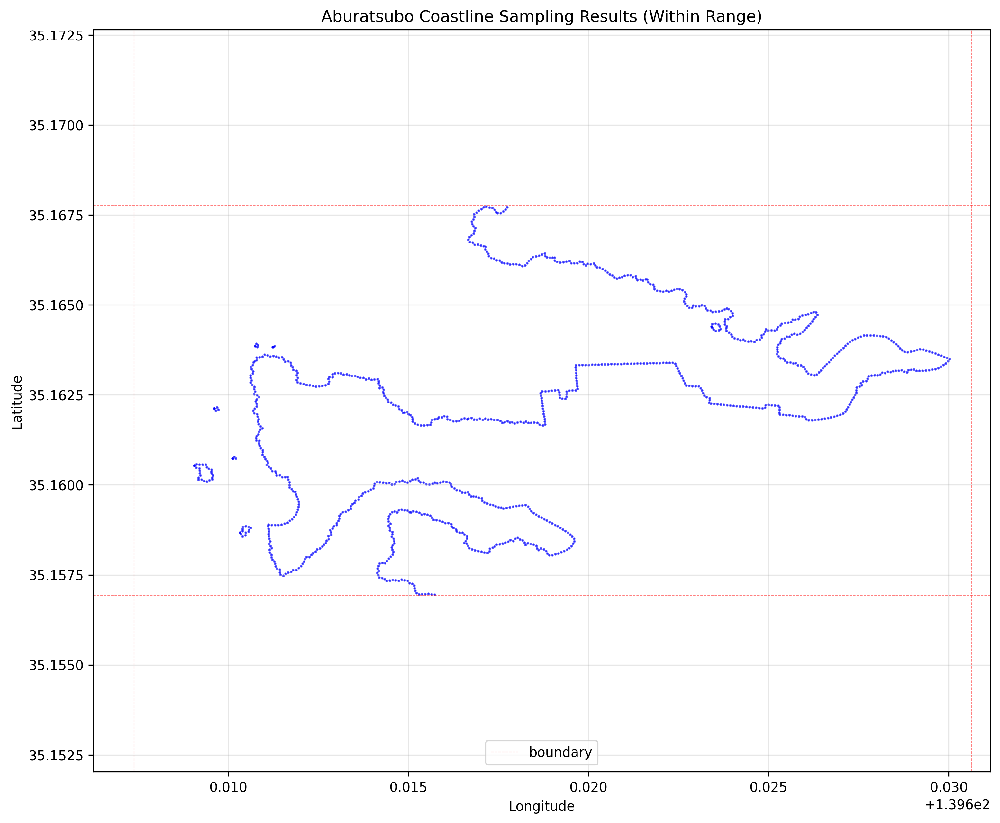
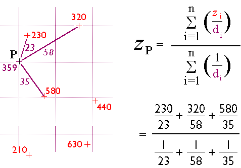

# aburatsubo-terrain-data

<br>

手漕ぎボートで油壷（神奈川県三浦市）の海に浮かんだときに採取した水深データです。

魚群探知機 [Deeper](https://deepersonar.jp/) を使って採取したものです。

<br><br>

## CSVデータ

**2025年10月** のデータが最後に採取した最新です。

[加工前のCSV](https://takamitsu-iida.github.io/aburatsubo-terrain-data/data/ALL_depth_map_data_202510.csv)

[加工後のCSV](https://takamitsu-iida.github.io/aburatsubo-terrain-data/data/ALL_depth_map_data_202510_de_dd_ol_ip_mf.csv)

<br>

|       |            lat |             lon |        depth |            epoch |
|:------|---------------:|----------------:|-------------:|-----------------:|
| count | 164979         | 164979          | 164979       | 164979           |
| mean  |     35.164     |    139.607      |     17.0116  |      1.59862e+12 |
| std   |      0.0021361 |      0.00418346 |      9.74208 |      8.38241e+10 |
| min   |     35.1572    |    139.554      |      1.082   |      1.50491e+12 |
| 25%   |     35.1628    |    139.604      |      8.899   |      1.51399e+12 |
| 50%   |     35.1639    |    139.607      |     15.333   |      1.5927e+12  |
| 75%   |     35.1649    |    139.609      |     24.071   |      1.68696e+12 |
| max   |     35.1797    |    139.622      |     47.539   |      1.75964e+12 |

<br>

epoch列はスキャンしたUNIX時です。JSTに変換するとこのような時刻になります。

Oldest epoch (JST): 2017-09-09 07:08:11

Newest epoch (JST): 2025-10-05 13:19:12

<br><br>

## 3D可視化

Deeperのサブスクリプション会員になると3Dでマップが表示されるようですが、
契約していませんので、可視化ツールを自作しました。

油壷専用です。

[Live Demo](https://takamitsu-iida.github.io/aburatsubo-terrain-data/index-bathymetric-data.html)

[Live Demo (開発中)](https://takamitsu-iida.github.io/aburatsubo-terrain-data/index-dev.html)

<br>

**スクリーンショット** (ポイントクラウド)


<br>

**スクリーンショット** (ワイヤフレーム)


<br>

**スクリーンショット** (メッシュ)


<br>

**スクリーンショット** (等深線)


<br>

**TODO**

- 地図(mapboxとか？)と連動させて、どの場所のデータでも可視化できるようにする

<br><br>

## 不足データ

ドロネー三角形の大きさを制限すると、データ不足の領域が空白地帯になります。


<br>

2025年10月現在、油壷の北側の海域はまだまだデータ不足です。北側で釣りをすることが少ないためです。

**TODO**

- もっと釣りに行ってデータを収集する、特に北側の海域

<br><br>

## CSVファイルの概要

2025年10月時点でのデータのサイズは約6.5MBです。

各行は `(lat, lon, depth, unix_time_in_msec)` で構成されています。

先頭の3行はこのようになっています。

```text
35.162872,139.61423,2.747,1659737621643
35.16289,139.61423,2.831,1659737623625
35.162903,139.61421,2.987,1659737624655
```

緯度(lat)は小数点以下6桁、経度(lon)は小数点以下5桁になっています。

これは概ね1m程度の分解能ということになります。

3Dで可視化するときに、1mよりも細かくメッシュ化しても正確な海底地形を表しているとはいえないので、
2m程度でメッシュ化するのが目安になると推測できます。

1行目のUNIX時間と2行目のUNIX時間との差は約2秒です。

これは水深のスキャンが2秒に一度、というわけではなく、GPS座標の取得が2秒に一度実行されている、というだと思います。

<br>

CSVファイルの最後の3行

```text
35.16161,139.60029,32.5,0
35.16162,139.60031,33.05,0
35.16162,139.60031,32.39,0
```

古いデータはUNIX時間が欠落していて0になっています。

概ね2017年よりも古いデータはUNIX時間が欠落している模様です。

緯度(lat)方向の分解能も低くなっています。これは初代Deeperと現行機種との機能差かもしれません。

古いデータはdropした方が良さそうです。

<br><br><br>

# データ加工処理

<br>

水深は手漕ぎボートの直下しか探知できませんので、(lat, lon)を散布図で可視化するとボートが移動した軌跡の線状になります。

そのままのデータは3次元での可視化に難がありますので、加工します。

<br><br>

## 位置の重複排除

GPS座標(lat, lon)が重複したデータも多くありますので、まずは重複を排除します。

GPS座標が重複した部分は水深の平均値を算出して置き換えます。

この処理はPandasを使うと1行で処理できます。

```python
df_uniq = df.groupby(['lat', 'lon'], as_index=False).agg({'depth': 'mean', 'epoch': 'max'})
```

重複排除前が164979件に対して、排除後は106424件になりますので、重複数は58555件ということになります。

実に全データの35%が重複したデータということになります。

アンカーを下ろして釣りをすることが多いので、特定の場所のデータ密度が濃く、重複したデータも増えてしまいます。

座標が重複したデータは、ボートの軌跡を時系列でアニメーション表示するときには大事ですが、今は海底地形を可視化したいだけなので単純に排除して軽くします。

<br><br>

## 位置の異常値排除

重複を排除した状態の散布図です。明らかに異常値が存在します。


このような異常値の排除は、Local Outlier Factor（局所外れ値因子法）もしくはIsolation Forestを使うことで取り除けます。

sklearnを使えば簡単に処理できます。

ここではLOFを使います。LOFでは近傍点の数をパラメータとして指定しますが、デフォルトのまま20としています。

```python
def local_outlier_factor(df: pd.DataFrame, n_neighbors: int = 20, features: list = ["lat", "lon"]) -> pd.DataFrame:
    """Local Outlier Factor (LOF)を使用して外れ値を検出し、除去したデータフレームを返す関数。

    Args:
        df (pd.DataFrame): 入力データフレーム。'lat'および'lon'列を含む必要があります。
        n_neighbors (int, optional): 近傍点の数. デフォルトは20.
        features (list, optional): 使用する特徴量のリスト. デフォルトは["lat", "lon"].

    Returns:
    """

    # n_neighborsはデータ数が数百件以下のような少ない場合は5～10が推奨され、
    # 数千件以上のような多い場合は20～50が推奨される。
    # scikit-learnのデフォルトは20
    # https://scikit-learn.org/stable/modules/generated/sklearn.neighbors.LocalOutlierFactor.html

    # LOFモデルの作成と適合
    lof = LocalOutlierFactor(n_neighbors=n_neighbors)

    # 特徴量を指定してデータを抽出（デフォルトは緯度と経度）
    X = df[features]

    # 学習させる
    lof.fit(X)

    # 予測を行う
    # 各サンプルの予測結果。1は正常、-1は外れ値を示す。
    predicted: np.ndarray = lof.fit_predict(X)

    # 外れ値を除去したデータフレームに置き換える
    df = df[predicted == 1].reset_index(drop=True)

    # 結果を返す
    return df
```

異常値を取り除いた状態の散布図です。キレイになりました。


CSVデータには位置の異常値だけでなく、水深の異常値もあるのですが、これを機械的に取り除くには調整が難しいため、今回は適用していません。

一番欲しい情報である海底の根の情報が消えないように、異常値だけを取り除く調整が難しいためです。

最後の処理で、海底地形を滑らかにするために水深に関してメディアンフィルタをかけていますので、この処理である程度の異常値は消えると思います。

<br><br>

## 集約処理

手漕ぎボートで海に浮かぶときには、移動中に採取したところは線状になり、アンカーを下ろして釣りをしているときのデータは密度の濃い点群になります。

密度が濃すぎるところを間引きをします。

四分木で領域を分割して、最も深いレベルの葉ノードのデータを一つに集約します。

この処理では単純に平均を取ってます。

<br><br>

## 補間処理

データが線状になっているところ、密度が薄いところは3Dでメッシュ化するためにデータ数を増やします。

この処理が一番の悩みどころです。

データの周囲をグリッド化してクリギングで補間する、というのが正確性の観点から良さそうですが、いかんせん処理に時間がかかります。

まだ決定打はないのですが、現在手持ちしているデータに関しては、単純にデータ数を増やすだけでいいのかもしれません。

Deeperが提供するマップ（等深線図）をみると、一つの点を六角形になるように拡張しているようにみえます。

それでもいいのですが、もっと単純化して東西南北に4点を増やすだけでもいい感じに見えます。

現時点では、以下の２つの補間処理を施していますが、前者はいらないかも、と考えています。

- データを持たない葉ノードに関して、3個以上の隣接ノードにデータがあれば、その値を使って補間する
- 密度の低い葉ノードに関して、（メッシュ化できるように）東西南北に4点増やす

<br><br>

## 海岸線のデータを追加

海岸線は水深0mの地点の集合です。
topojsonデータから輪郭のGPS座標を抽出して、水深0mの地点としてデータに追加してみます。

[extract_coast_line.py](/topojson/extract_coast_line.py) を使って特定の範囲内の地図の輪郭を10m間隔で抽出します。

実行例。

```bash
(.venv) iida@FCCLS0073460:~/git/aburatsubo-terrain-data$ topojson/extract_coast_line.py
2025-11-13 17:52:13,255 - INFO - 処理するジオメトリ数: 141
2025-11-13 17:52:13,984 - INFO - サンプリングされたGPS座標の数: 1045
2025-11-13 17:52:13,985 - INFO - 最初の10点:
2025-11-13 17:52:13,985 - INFO -   緯度: 35.156947, 経度: 139.615731
2025-11-13 17:52:13,985 - INFO -   緯度: 35.156965, 経度: 139.615644
2025-11-13 17:52:13,985 - INFO -   緯度: 35.156975, 経度: 139.615556
2025-11-13 17:52:13,985 - INFO -   緯度: 35.156973, 経度: 139.615466
2025-11-13 17:52:13,985 - INFO -   緯度: 35.156970, 経度: 139.615376
2025-11-13 17:52:13,985 - INFO -   緯度: 35.156957, 経度: 139.615294
2025-11-13 17:52:13,985 - INFO -   緯度: 35.156992, 経度: 139.615224
2025-11-13 17:52:13,985 - INFO -   緯度: 35.157060, 経度: 139.615189
2025-11-13 17:52:13,985 - INFO -   緯度: 35.157130, 経度: 139.615167
2025-11-13 17:52:13,985 - INFO -   緯度: 35.157200, 経度: 139.615162
```

<br>

実行結果のCSVをscatterで描画したもの。地図の輪郭を抽出できています。



これら点を水深0mとして追加することで、海底地形図と地図の輪郭がくっつくようになります。

<br><br><br><br>

## 実行環境の整備

binディレクトリにCSVデータを整形するPythonスクリプトを配置します。

topojsonディレクトリには海岸線データを抽出するPythonスクリプトを配置します（実行するは一度だけ）。

testsディレクトリにはテスト用スクリプトを配置します。

binディレクトリにあるスクリプトを異なる場所（たとえばtestsディレクトリ）からimportするにはPYTHONPATHの設定が必要になります。

vscodeは .env ファイルがあればそれを自動で読み取るので、以下のように設定します。

```bash
PYTHONPATH=bin
```

あとはvenvで仮想環境を整えます。

```bash
python3 -m venv .venv
pip install --upgrade pip
pip install -r requirements.txt
```

venvを使うときにはdirenvもあわせて導入しておくと楽になります。

<br><br><br>

# 以下、自分用作業メモ

<br>

時間が経つとやり方を忘れてしまうのでメモ。

<br><br>

## CSVデータのダウンロード

Deeperの地図サイトからCSV形式でデータをダウンロードします。

https://maps.fishdeeper.com/ja-jp


~~ファイル名は共通で `bathymetry_data.csv` となっています。~~

ファイル名は共通で `depth_map_data.csv` となっています。

<br>

> [!NOTE]
>
> 2024年8月追記。
>
> Deeperの仕様が変わって、ハンバーガーメニューからダウンロードを選択すると、depth_map_data.csvというファイルが取得できます。
>
> 仕様変更前にダウンロードしたファイルは `./data/bathymetry_data.csv` として残してあります。

<br>

> [!NOTE]
>
> 2024年8月追記。
>
> 2017年9月よりも古いデータは参考にならないと判断してクラウドから削除しました。

<br>

> [!NOTE]
>
> 水深データの一括ダウンロードは大変重たい処理のようで、長い時間かかるため失敗することが多いです。
>
> 感覚的には10回に1回くらいしか成功しません。
>
> 釣行ごとの水深データを落として、自分で結合したほうがいいかもしれません。

<br><br>

## データ加工処理

中間ファイルを作りながら、順番に処理していきます。

処理の順番を忘れてしまうのと、中間ファイルの名前を手打ちしたくないので、makeで処理します。

```bash
$ make
dd                             step1. deduplicate 重複する座標データを削除して新しいCSVファイルを作成する
ol                             step2. outlier 外れ値を検出して新しいCSVファイルを作成する
ip                             step3. interpolate 欠損値を補間して新しいCSVファイルを作成する
mf                             step4. median filter メディアンフィルタを適用して新しいCSVファイルを作成する
all                            重複排除→外れ値除去→補間→メディアンフィルタを順に全て実行
scatter                        散布図を作成する
clean                          データファイルを削除する
```

新しいCSVデータを入手したら、そのファイル名をMakefileに記述してから `make all` します。

最終的には `./static/data/bathymetric_data.csv` が生成されます。

それを3Dで可視化するには index-bathymetric-data.html を使います。

HTMLファイルをvscodeで右クリックすれば即座に確認できます。

<br><br>

## お試しで実装中

`bin/qtree.py` で試しているやり方

1. step1. 小さな領域になるまで四分木を作って、最も深いレベルにある葉ノードのデータは一つに集約
2. step2. 大きな領域に四分木を作り直して、密度の低い領域の点は、東西南北4点を追加
3. step3. 点を追加したのでもう一度step1を実行して集約

この処理でデータ数と見た目のバランスはいい感じになります。

<br><br>

## 座標系メモ

latとlon、どっちが緯度でどっちが経度かすぐにわからなくなってしまいます。

<dl>
<dt>latitude</dt> <dd>緯度</dd>
<dt>longitude</dt> <dd>経度</dd>
</dl>

Deeperからダウンロードしたデータは(lat, lon, depth)の順になっています。

Three.jsで可視化するときには、X軸をlon, Z軸をlat、Y軸にdepthを対応させています。

```text
    Y(depth)
    ↑
    |
    +------>X(lon)
   /
  /
 Z(lat)
```

XZ平面に地図を描画して、Y軸のマイナス方向が深さになるようにしています。

とてつもなくややこしいです。

<br><br>

## 使っている技術

Python

- Quad Tree 四分木　データが存在する場所で分割するのに使います
- R-Tree データが存在する領域に分割するのに便利ですが、今は使ってません
- KD-Tree 近傍点を取り出すときに使います。　`from scipy.spatial import cKDTree`
- LOF 異常値を排除するのに使います　`from sklearn.neighbors import LocalOutlierFactor`
- Isolation Forest 異常値を排除するのに使います　`from sklearn.ensemble import IsolationForest`
- Kriging クリギング 地形を補間するときによく使われます　`from pykrige.ok import OrdinaryKriging`
- Median Filter 水深データを滑らかにするのに使います

<br>

JavaScript

- Delaunator 点群からドロネー三角形のメッシュを生成するときに使います　`delaunator-5.0.1`
- Three.js ３次元の可視化に使います　`Revision 168`

<br><br>

## 参考文献

[The Nature of Geographic Information](https://www.e-education.psu.edu/natureofgeoinfo/c7_p9.html)

<br>

[Design a Geo-Spatial index for real-time location search](https://kousiknath.medium.com/system-design-design-a-geo-spatial-index-for-real-time-location-search-10968fe62b9c)

<br>

[A dive into spatial search algorithms](https://blog.mapbox.com/a-dive-into-spatial-search-algorithms-ebd0c5e39d2a)

<br><br><br><br>

# 実装メモ

<br>

最初の頃はGo言語で書いてましたが、データ処理のライブラリの豊富さを考慮して現在は全てPythonで処理しています。

<br><br>

## 外れ値検出

Local Outlier Factor（局所外れ値因子法）を利用します。

**LOFの考え方**

- 自分を中心に円を書き、k個の近傍点が入るように円を拡大していく

- 円に入ったk個の点それぞれにつき、同じように円を書き、k個の近傍点が入るように円を拡大していく

- 自分の円を含め、合計1+k個の円ができる

- 自分の円の大きさが、他の円と比べてやたら大きい場合は異常値なのではないか、と推測する

<br>

**LOFの手順**

1. 到達可能性距離（Reachability Distance）を計算

2. 局所到達可能性密度（Local Reachability Density）を計算

3. LOF（Local Outlier Factor）を計算

<br>

### 到達可能性距離とは（Reachability Distance）

前述の円の大きさのことです。

このように定義されます。

` reachability_disktance_k(a,b) = max{k_distance(b), d(a, b)} `

```text

 a  b
    c   d

```

k=2の場合、

- aを取り出す
- aから一番近い隣接ノードbを取り出す
- bからk番目に近い点を取り出す（この場合はdを取り出す）
- a-b間の距離とb-d間の距離の大きい方を取り出したものが `reachability_disktance_k(a,b)` となる
- aから二番目に近い隣接ノードcを取り出す
- cからk番目に近い点を取り出す、以下同様

自分を含めて1+k個の到達可能性距離を求めることになります。

<br>

### 局所到達可能性密度とは（Local Reachability Density）

このように定義されます。

`lrd_k(a) = 1 ÷ (reachability_disktance_k(a, b) + reachability_disktance_k(a, c)) / 2`


```text

 a  b
    c   d

```

- aを取り出す
- aの近傍点b, cを取り出す
- reachability_disktance_k(a, b)を計算する、つまりbからk番目に遠い点の距離を計算して、大きい方を採用する
- reachability_disktance_k(a, c)を計算する、つまりcからk番目に遠い点の距離を計算して、大きい方を採用する
- reachability_disktance_k(a, b)とreachability_disktance_k(a, c)の平均値を出す
- 1をそれで割る

<br>

### LOFとは（Local Outlier Factor）

このように定義されます

`LOF_k(a) = ( lrd_k(b)/lrd_k(a) + lrd_k(c)/lrd_k(a) ) / k`

これが大きいほど、異常値と考えられます。

<br>

### scikit-learnによるLOF

自分で計算すると大変ですが、scikit-learnに実装されているLocalOutlierFactorを使えば簡単に処理できます。

```python
from sklearn.neighbors import LocalOutlierFactor
```

kの値は、引数n_neighborsで与えます。

適切な値は試行錯誤で決めますが、デフォルト値が20なので、まずはそのまま適用します。

```python
        def local_outlier_factor(n_neighbors=20):
            lof = LocalOutlierFactor(n_neighbors=n_neighbors)
            X = df[["lat", "lon"]]
            lof.fit(X)
            predicted = lof.fit_predict(X)
            return predicted
```

predictedは外れ値なら-1、正常値なら1が格納された行列です。

```python
        # 外れ値を除く処理を施す
        pred = process_outlier(df)

        # 外れ値のみのデータ
        outlier = df.iloc[np.where(pred < 0)]

        # dfを外れ値データを除いたデータに置き換える
        df = df.iloc[np.where(pred > 0)]
```

<br><br>

## データ補間

ポイントクラウドを可視化してみると補間の必要性が直感的に理解できます。

この手のデータ補間にはIDWアルゴリズムもしくはクリギングが使われます。

**IDW(inverse distance weighted)**

GPS座標が存在する範囲をグリッド化して、各グリッドでの推定値を計算します。



> 引用元
>
> https://www.e-education.psu.edu/natureofgeoinfo/c7_p9.html

グリッドの格子点の近傍に存在する値を取ってくる必要がありますが、この方法はいくつか考えられます。

KD-Treeを使って半径何メートルの中の点を取ってくる、というのが一番簡単な気がします。

他にもR-treeを使って、指定した領域の範囲に入る点を取ってくる、という方法もあります。

<br><br><br>

### jupyter notebook

（今は使ってませんが）試行錯誤しながらデータを加工するにはjupyter notebookが便利です。

WSLにインストールする方法。

```bash
pip install jupyter
```

venvを使っている場合はその環境下にインストールされます。

WSLでjupyterを走らせるには、設定の追加が必要です。

`--generate-config`オプションをつけて起動すると、デフォルトのコンフィグファイルが `~/.jupyter/jupyter_notebook_config.py` に作成されます。

```bash
iida@FCCLS0073460:~/git/aburatsubo-terrain-data$ jupyter notebook --generate-config
Writing default config to: /home/iida/.jupyter/jupyter_notebook_config.py
```

ホームディレクトリ直下に作られるので、環境ごとに設定を変更することはできません。

なので、このファイルをコピーして編集した別のコンフィグファイルを作ります。

まずは、ノートブックを保存したいディレクトリ（ここではipynb）を作って、そこに移動し、デフォルトのコンフィグファイルをコピーします。

```bash
mkdir ipynb
cd ipynb
cp ~/.jupyter/jupyter_notebook_config.py .
```

追加すべき設定は `c.NotebookApp.use_redirect_file = False` という1行だけなので、以下のようにコンフィグファイルの最後に追記します。

```bash
$ echo "c.NotebookApp.use_redirect_file = False" >> jupyter_notebook_config.py
```

実行するときに `--config` オプションで編集した設定ファイルを指定します。

```bash
jupyter notebook --config jupyter_notebook_config.py
```

終了するときは `ctrl-c` を2回連打します。

ターミナルを占有されてしまうのを避けるには、バックグランドで起動します。

```bash
nohup jupyter notebook --config jupyter_notebook_config.py >> jupyter.log 2>&1 &
```

停止するにはブラウザで `File -> Shut Down` を選択します。

```bash
pgrep -f jupyter-notebook
```

でプロセスを探してkillしても同じです。

起動時のオプションが多くて手打ちするのは大変なのでシェルスクリプトにしました。

```bash
./start-jupyter.sh
```

シェルスクリプトの中身はこうなっています。

```bash
#!/bin/bash

# このファイルのある場所
CURRENT_DIR=$(cd $(dirname $0);pwd)

# Start Jupyter Notebook
# logディレクトリがなければ作成する
if [ ! -d $CURRENT_DIR/log ]; then
    mkdir $CURRENT_DIR/log
fi

# すでに実行中のjupyter notebookがないか確認する
if pgrep -f jupyter-notebook > /dev/null; then
    echo "Jupyter Notebook is already running."
    exit 1
fi

# Jupyter Notebookをバックグラウンドで起動する
# nohup: ログアウト後もプロセスを継続する
nohup jupyter-notebook --config $CURRENT_DIR/jupyter_notebook_config.py --notebook-dir $CURRENT_DIR >> $CURRENT_DIR/log/jupyter.log 2>&1 &
echo "Jupyter Notebook started. Check log/jupyter.log for details."
echo "You can access the notebook at http://localhost:8888"
```


<br><br>

## 3D可視化

Three.jsで可視化します。

Three.jsでの可視化の例はここにまとめました。

https://github.com/takamitsu-iida/threejs-practice

<br>

点群をメッシュ化するアルゴリズムはドロネー図を使っています。

JavaScriptではdelaunatorjsを使っています。

<br>

> [!NOTE]
>
> Wikipediaを見たら **ドロネー図** と書かれていました。
>
> 長い間、デローネ三角形と呼んでました（恥）

<br>