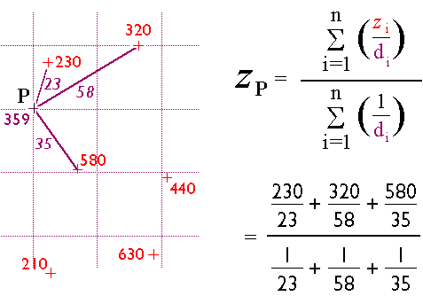

# aburatsubo-terrain-data

<br>

https://takamitsu-iida.github.io/aburatsubo-terrain-data/data/data.csv

<br>
<br>

## CSVデータ

Deeperの地図アプリからCSV形式でデータをダウンロードする。

https://maps.fishdeeper.com/ja-jp

~~ファイル名は共通で `bathymetry_data.csv` となっている。~~

> [!NOTE]
>
> 2024年8月追記。
>
> 仕様が変わって、ハンバーガーメニューからダウンロードを選択すると、depth_map_data.csvというファイルが取得できる。
>
> 釣行ごとのファイルの場合、水深マップかスキャンデータ、どちらかを選択してダウンロードできるようになっている。

<br>

> [!NOTE]
>
> 2024年8月追記。
>
> 2017年9月よりも古いデータは参考にならないと判断してクラウドから削除。
>
> 重複しているデータもクラウドから削除。

<br>

> [!NOTE]
>
> 水深データの一括ダウンロードは大変重たい処理のようで、長い時間かかるため失敗することが多い。
> 感覚的には10回に1回くらいしか成功しない。
> 釣行ごとの水深データを落として結合したほうがいいかもしれない。

<br>

> [!NOTE]
>
> ファイルが多すぎてわけがわからなくなりそうなのでメモ。
>
> main.pyで `ALL_depth_map_data_202408.csv` を読み込んで `data.csv` を出力している。
>
> `data.csv` をJavaScriptでポイントクラウドとして可視化して、明らかに異常値と考えられる点を目視で削除したのが `depth_map_data_edited.csv` である。

<br>

サイズは約8MBで約22万行。

各行は `lat, lon, depth, unix_time_in_msec` の情報で構成されている。

先頭の3行

```text
35.162872,139.61423,2.747,1659737621643
35.16289,139.61423,2.831,1659737623625
35.162903,139.61421,2.987,1659737624655
```

緯度(lat)の分解能は小数点以下6桁。経度(lon)の分解能は小数点以下5桁。
概ね1m程度の分解能になっている。

1行目のUNIX時間1659737621643は2022年8月6日7時13分41.643秒を表している。
2行目のUNIX時間との差は約2秒。
ということはDeeperは2秒に一度、スキャンしていることになる。

CSVファイルの最後の3行

```text
35.16161,139.60029,32.5,0
35.16162,139.60031,33.05,0
35.16162,139.60031,32.39,0
```

古いデータはUNIX時間が欠落していて0になっている。
概ね2017年よりも古いデータはUNIX時間が欠落している模様。

緯度方向の分解能も低くなっている。これは初代Deeperと現行機種との差かも。

古いデータはdropしてもいいけど、今回はそのまま利用する。


CSVファイルをpandasで読み取った時点での統計値。

|       |             lat |             lon |        depth |
|:------|----------------:|----------------:|-------------:|
| count | 222642          | 222642          | 222642       |
| mean  |     35.1635     |    139.607      |     17.8339  |
| std   |      0.00147178 |      0.00355166 |      9.38083 |
| min   |     35.1572     |    139.554      |      1.426   |
| 25%   |     35.1625     |    139.604      |     10.158   |
| 50%   |     35.1637     |    139.607      |     15.8     |
| 75%   |     35.1645     |    139.609      |     25.71    |
| max   |     35.1797     |    139.622      |     46.984   |

CSVから読み取った状態での散布図。左上に異常値が存在する。


重複した座標も多くあり、pandasで分析すると75,402件が重複している。
重複した部分はgroupbyで集約して水深の平均値を算出し、重複行を削除したあと、集約したものを加えている。


異常値として検出されたデータ。
1,039件と思いのほか多くのデータが異常値として弾かれた。


異常値を除いたデータ。


重複を削除、異常値を削除した状態でのdescribe()はこの通り。

|       |             lat |             lon |        depth |
|:------|----------------:|----------------:|-------------:|
| count | 107440          | 107440          | 107440       |
| mean  |     35.1641     |    139.608      |     16.4776  |
| std   |      0.00237647 |      0.00435879 |      9.62367 |
| min   |     35.1572     |    139.599      |      1.082   |
| 25%   |     35.1628     |    139.604      |      8.409   |
| 50%   |     35.164      |    139.608      |     15.09    |
| 75%   |     35.1649     |    139.61       |     21.928   |
| max   |     35.1737     |    139.622      |     47.539   |


<br><br>

## 実行環境メモ

データの加工にPythonを使うので、venvを使ってPython仮想環境をセットアップする。

```bash
python3 -m venv .venv
```

シェル利用時にPython仮想環境を自動切換えするために`direnv`を利用する。

```bash
direnv edit .
```

エディタが開くので、以下の内容を追加して保存する。

```text
source .venv/bin/activate
unset PS1
```

<br><br>

## 座標系メモ

latとlon、どっちが緯度でどっちが経度かすぐにわからなくなる。

<dl>
<dt>latitude</dt> <dd>緯度</dd>
<dt>longitude</dt> <dd>経度</dd>
<dt>地球の半径</dt> <dd>6378.137 km 測地測量の基準としての半径</dd>
</dl>

<br><br>

# 参考文献（データ処理）

[Python で曲面近似（サーフェスフィッティング）する](https://chuckischarles.hatenablog.com/entry/2020/02/06/081238)

[カーブフィッティング手法 scipy.optimize.curve_fit の使い方を理解する](https://qiita.com/maskot1977/items/e4f5f71200180865986e)

[The Nature of Geographic Information](https://www.e-education.psu.edu/natureofgeoinfo/c7_p9.html)

<br><br>

# 実装メモ

Go言語の方が書きやすいものの、データ加工処理の容易さを考慮してPythonで処理。

<br>

## 重複削除のやり方

groupbyで集約しつつ、水深の平均を計算してそれに置き換える。

元データから重複行をすべて削除し、groupbyで計算したものを加える。

```python
    def process_duplicated(df: pd.DataFrame):
        dfx = df[["lat", "lon", "depth"]]
        dfx_uniq = df.drop_duplicates(subset=["lat", "lon"], keep=False)
        dfx_duplicated = dfx.groupby(["lat", "lon"])["depth"].mean().reset_index()
        df = pd.concat([dfx_uniq, dfx_duplicated]).reset_index(drop=True)
        return df
```

<br>

## 外れ値検出

Local Outlier Factorを利用する。

```python
from sklearn.neighbors import LocalOutlierFactor  # process_outlier()
```

```python
        def local_outlier_factor(n_neighbors=20):
            lof = LocalOutlierFactor(n_neighbors=n_neighbors)
            X = df[["lat", "lon"]]
            lof.fit(X)
            predicted = lof.fit_predict(X)
            return predicted
```

predictedは外れ値なら-1、正常値なら1が格納されたアレイ。

```python
        # 外れ値を除く処理を施す
        pred = process_outlier(df)

        # 外れ値のみのデータ
        outlier = df.iloc[np.where(pred < 0)]

        # dfを外れ値データを除いたデータに置き換える
        df = df.iloc[np.where(pred > 0)]
```

<br>

## データ補間

ポイントクラウドを可視化してみると補間の必要性が直感的に理解できる。

GPS座標が存在する範囲をグリッド化して、各グリッドでの推定値を計算する。

推定値はinverse distance weighted algorithmを用いる。



> 引用元
>
> https://www.e-education.psu.edu/natureofgeoinfo/c7_p9.html

そのためには、グリッドの格子点の近傍に存在する値を取ってくる必要がある。

これにはR-treeを使う。

ということで、当面はR-treeを使った近傍探索のやり方を模索する。


<br>

### Rtree

PythonでのRtreeの実装はいくつか存在する。

libspatialindexをPythonでラッピングしたRtreeを使ってみる。

2024年10月時点ではバージョン1.3がインストールされた。

```bash
(.venv) iida$ pip install rtree
Collecting rtree
  Downloading Rtree-1.3.0-py3-none-manylinux2014_x86_64.manylinux_2_17_x86_64.whl (543 kB)
     |████████████████████████████████| 543 kB 912 kB/s
Installing collected packages: rtree
Successfully installed rtree-1.3.0
```

> [!NOTE]
>
> libspatialindexのインストールが伴うので、Macだとコンパイル作業が走るかもしれない。
>


<br><br><br><br>

## Goコードの断片（あとで消す）


```go
func Round(x, unit float64) float64 {
    return math.Round(x/unit) * unit
}
```

```go
package main

 import (
 	"fmt"
 	"math"
 )

 type Coordinates struct {
 	Latitude  float64
 	Longitude float64
 }

 const radius = 6371 // Earth's mean radius in kilometers

 func degrees2radians(degrees float64) float64 {
 	return degrees * math.Pi / 180
 }

 func (origin Coordinates) Distance(destination Coordinates) float64 {
 	degreesLat := degrees2radians(destination.Latitude - origin.Latitude)
 	degreesLong := degrees2radians(destination.Longitude - origin.Longitude)
 	a := (math.Sin(degreesLat/2)*math.Sin(degreesLat/2) +
 		math.Cos(degrees2radians(origin.Latitude))*
 			math.Cos(degrees2radians(destination.Latitude))*math.Sin(degreesLong/2)*
 			math.Sin(degreesLong/2))
 	c := 2 * math.Atan2(math.Sqrt(a), math.Sqrt(1-a))
 	d := radius * c

 	return d
 }

 func main() {
 	pointA := Coordinates{2.990353, 101.533913}
 	pointB := Coordinates{2.960148, 101.577888}

 	fmt.Println("Point A : ", pointA)
 	fmt.Println("Point B : ", pointB)

 	distance := pointA.Distance(pointB)
 	fmt.Printf("The distance from point A to point B is %.2f kilometers.\n", distance)

 }
```